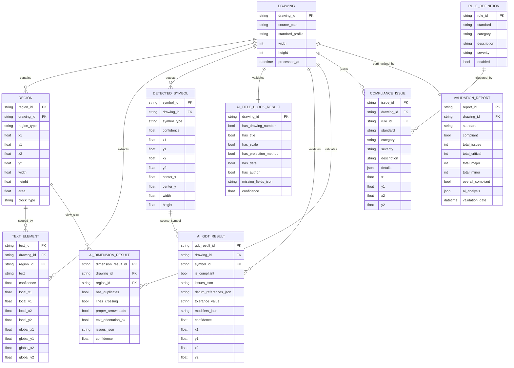

# DraftLint Data Architecture and Data Model

This document captures the current implementation so you can port it into RapidDraft with clear module and data boundaries.

## 1) Workflow and Data Architecture (Current Code)

```mermaid
flowchart LR
    A[Input Drawing<br/>PDF/PNG/JPG] --> B[Document Processor<br/>load_drawing]
    B --> C[Preprocess<br/>enhanced + binary]
    C --> D[Layout Analyzer<br/>regions dict]
    D --> E[regions_df<br/>Polars]
    C --> F[OCR Engine<br/>extract_text_with_context]
    D --> F
    F --> G[text_df<br/>Polars]
    C --> H[YOLO Symbol Detector]
    H --> I[symbols_df<br/>Polars]

    J[Standards Rules CSV<br/>data/standards/*.csv] --> K[rules_df]

    C --> L[AI Validator<br/>Azure OpenAI via LangChain]
    D --> L
    I --> L
    L --> M[ai_results<br/>title_block, gdt_callouts, dimensions]

    E --> N[Rule Validation]
    G --> N
    I --> N
    M --> N
    K -.loaded at init.- N
    N --> O[issues: list[ComplianceIssue]]
    O --> P[ValidationReport]
    M --> P

    P --> Q[Report Generator]
    A --> Q
    E --> Q
    G --> Q
    I --> Q

    Q --> R1[Annotated PNG]
    Q --> R2[Report JSON]
    Q --> R3[Report HTML]
    Q --> R4[regions/text/symbols/issues CSV]
```

## 2) Detailed Step Sequence

1. Load drawing from PDF/image.
2. Preprocess image (`enhanced`, `binary`).
3. Detect layout regions (`title_block`, `drawing_views`, etc.).
4. Export regions to `regions_df`.
5. OCR each region and create `text_df`.
6. Detect GD&T symbols and create `symbols_df`.
7. AI validation (optional flag, but validator init expects Azure config).
8. Build issues from AI outputs in `_run_rule_validation`.
9. Create `ValidationReport` with severity buckets and summary.
10. Persist outputs (JSON/HTML/CSV/annotated image).

## 3) Data Model Diagram (Canonical Porting Model)



## 4) RapidDraft Porting Notes

1. Keep three storage layers:
   - Raw assets: original and cropped images.
   - Feature tables: `regions`, `text_elements`, `detected_symbols`, AI result tables.
   - Decision layer: `compliance_issues`, `validation_report`.
2. Use `drawing_id` as the primary join key across all tables.
3. Keep `rule_id` explicit in every emitted issue so standards updates do not break historical reports.
4. Persist both model confidence and coordinates for auditability and UI trace-back.

## 5) Current Implementation Reality (Important)

1. `rules_df` is loaded at startup but not used directly in issue generation logic.
2. `_run_rule_validation` currently derives issues from `ai_results` only.
3. `compliant`/`overall_compliant` is `len(critical)==0`, so major issues can still return compliant.
4. `rule_validator.py`, `api/routes.py`, `src/models/standards.py`, and `src/utils/image_utils.py` are placeholders (empty files).
5. Azure settings are required by config fields even though docs describe AI as optional.
